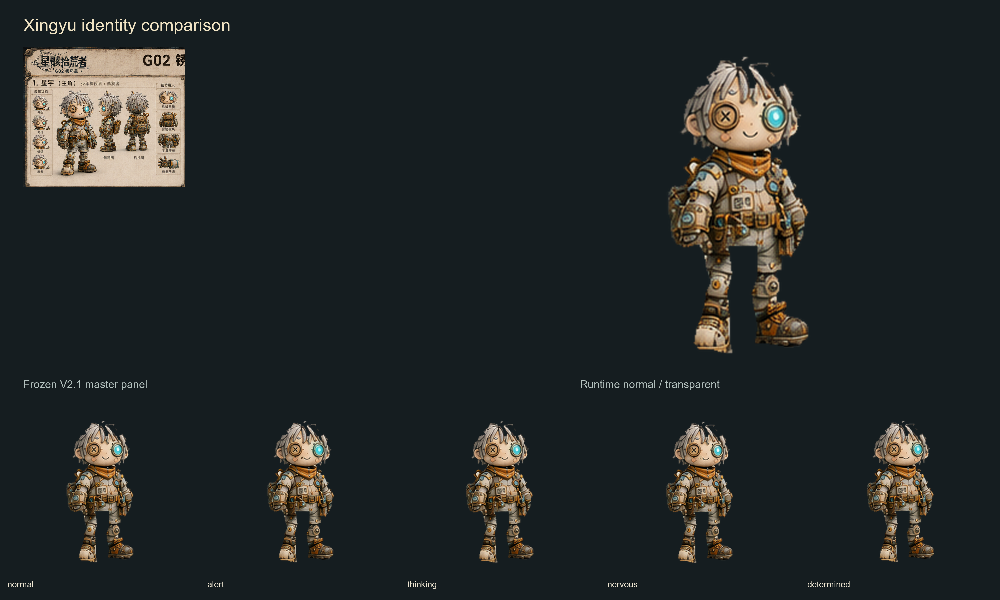
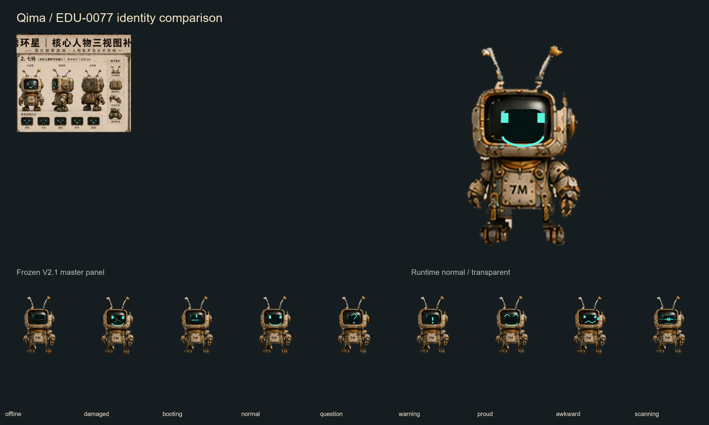

# 角色身份母版对照

## 星宇

锁定特征：布偶机械生命体、13—15 岁视觉年龄、纽扣眼、青蓝电子镜片眼、灰白毛毡发片、氧化橙围领、工具腰带、旧靴与修补痕迹。实际局部修改仅为嘴形、电子眼光强和轻微姿态偏移。

## 七码

锁定特征：EDU-0077 身份、旧 CRT 头部、双天线、奶黄/旧铜/氧化橙机身、青绿色像素表情、短机械臂和轮足。实际局部修改仅为 CRT 状态、轻微故障线、扫描层和轻微姿态偏移。

## 风险与声明

- 正式母版为 1448×1086 综合三视图板，运行时切片经过高倍率放大；近距离查看会保留母版的定格插画颗粒。
- 天线、发丝和旧毛毡边缘来自板内像素，已做 alpha 去污染，但仍保留手工磨损轮廓。
- PR #5 中自行生成的角色、场景和道具美术未复用。
- 本页不是正式剧情 UI，未启动 Issue #3。
